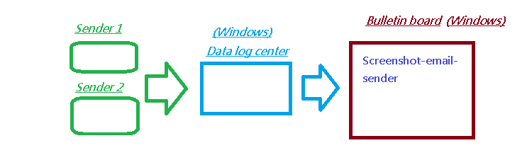
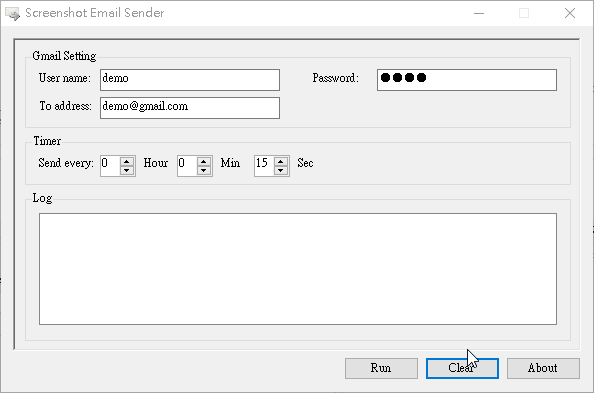

- ## screenshot-email-sender
	- Take screenshots as email attachments and send them at time intervals.
	- The program works on Windows.
- ### User Case
	- 
- ### :crossed_swords:Functions
	- Set mail sender.
	- Set time interval.
- ### :film_projector:Demo
  
- ### ??History
	- Version 1.0.0 - Date 2008/8/13
		- send screenshot of SimReport window to gmail
	- Version 1.2.3 - Date 2008/8/15
		- Purpose change: send screenshot to gmail
		- 1. Fix bug: Another programm is processing the file.
		  Solution: MailMessage.Dispose();
		- 2. Fix bug: The program freezes.
		  Solution: Take screenshots and send email actions execute in a single thread.
		- 3. Fix bug:SmtpException: The SMTP server requires a secure connection or the client was not authenticated.
		  Solution: UseDefaultCredentials, Credentials, EnableSsl of SmtpClient settings are not correct.
		- 5. Add: Log function
		- 6. Add: clear log button
	- Version 1.2.4 - Date 2008/8/25
		- 1. Add: Exception message
		- 2. Fix bug: Send mail error and capture the same screenshot every time.
		  Solution: On the first error, the image is locked. Cause the second screenshot image cannot be written. After fixing the bug, it takes a different screenshot every time even if the email is wrong.
	- **NOTE**: if you already have made a connection and the server somehow dies , you will get following exception if you try to send data.
An existing connection was forcibly closed by the remote host
	- **IMPORTANT**: How to fix error `The SMTP server requires a secure connection or the client was not authenticated. The server response was: 5.5.1 Authentication Required`?

Go to your Google account to enable option **Less Secure Sign-in** (or **less secure app access**). After sign in Google account, go to the [lesssecureapps page](https://www.google.com/settings/security/lesssecureapps).  Or the other [lesssecureapps link](https://myaccount.google.com/lesssecureapps)
- ### :sparkling_heart: Buy me a coffee 
  If the utility solves your problem, you can buy me a coffee via [this link](https://www.buymeacoffee.com/zhihau).
- ### License
  MIT
